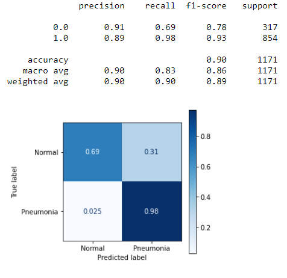

# Pneumonia X-Ray Image Classification Project

## Overview

This project analyzes chest x-rays to determine whether a patient has pneumonia or not using various Neural Network Models.

## Business Problem

The Uk has one of the lowest counts of radiologists per population with 7 radiologists (including trainees per 100,000 population compared to the European average of 12 radiologists. The low number of UK radiologists within the National Health Service system has increased the costs due to overtime and outsourcing and has lowered the quality provided due to the increased wait and reporting turnaround times. Finally, the current UK consultant radiology workforce will retire within the next ten years. Within the next fifteen years, around half of the current workforce will retire.

To improve standards and the quality of life for UK radiologists, SJB Solutions plans to automate the x-ray image diagnosis step for radiologists by implementing a predictive model that will be able to determine whether a patient has pneumonia or not with a 90% accuracy while also minimizing the percent of false negatives. This will reduce the time between a patient first being admitted into a hospital to being treated for pneumonia dramatically. 

## Data

The dataset is organized into 3 folders (train, test, val) and contains subfolders for each image category (Pneumonia/Normal). There are 5,863 X-Ray images (JPEG) and 2 categories (Pneumonia/Normal).

Chest X-ray images (anterior-posterior) were selected from retrospective cohorts of pediatric patients of one to five years old from Guangzhou Women and Children’s Medical Center, Guangzhou. All chest X-ray imaging was performed as part of patients’ routine clinical care.

For the analysis of chest x-ray images, all chest radiographs were initially screened for quality control by removing all low quality or unreadable scans. The diagnoses for the images were then graded by two expert physicians before being cleared for training the AI system. In order to account for any grading errors, the evaluation set was also checked by a third expert.

## Method

### Pre-processing

Due to the imbalance in the test-train-split, the pneumonia and normal x-ray images were reorganized manually from each folder into a normal and pneumonia folder and then re-split into a 60%, 20%, and 20% for the train, test and validation datasets.

The next step of the preprocess was to address the class imbalance between normal and pneumonia images. Data augmentation was the main method used to solve for this. 


### Models

The baseline model was a dummy classifier model using a ‘most_frequent’ strategy to establish a baseline accuracy score of 73% for both the train and test dataset. 

The first model consisted of a dense hidden layer with 20 neurons and a 'relu' activation function. ReLU is one of the most commonly used activation functions and it's especially useful in computer vision problems like image classification.

Since this is a binary classification problem, our output layer will need to be a Dense layer where the number of neurons is the same as the number of classes in the labels. Thus, we will use 1 neuron and a 'sigmoid' activation function for the output layer.

We will compile this model with a 'sgd' (stochastic gradient descent) as the optimizer, 'binary_crossentropy' as the loss function, 'accuracy' as the metrics.

The first model performed with any accuracy of 73% for the train and test dataset which performed on the same level of the baseline model.

The second model builds off the first model and adds three additional layers in the hopes to improve the score. The second model performed significantly better with an accuracy and recall score with a 77% and 86% accuracy score for the train and test set, respectively.

The third model is Convolutional Neural Network which is a subset of neural networks that contains at least one convulation layer and is ideal for reducing complexity of the model to improve training speed and reduces the chance of overfitting. However, the model produced a score of 93% and 89% for the train and test set, respectively which indicates that the model is overfitting.

The fourth model included weight classes to see how this will affect the scores. Weight classes is another method to address a class imbalance. More weight was given to the normal images to reduce overfitting. The model produced a score of 98% and 90% for the train and test set, respectively. In addtion, the recall score of this model was 93% which lowered the changes of false negatives. This is especially important in the healthcare field because it is more important to minimize the chances being diagnosed normal but actually has pneumonia vs being diagnosed with pneumonia and not actually having it. 


## Results 

The fourth model was chosen because it was able to determine whether a patient had pneumonia by examining their x-ray image with a 98% accuracy score and 93% recall score.


### Train Score


### Test Score




## Future Analysis

The next step of the work would be to expand our model to be able to predict whether the pneumonia is bacterial vs viral so that the correct treatment could be implemented from the start. Afterwards, the model could be further expanded to be able to predict other diagnoses that are primarily made through x-ray images such as bone fractures, congestive heart failure, and digestive tract problems. Finally, once it is determined that the model has successfully improved the standards and quality of life for UK radiologists, the model should be rolled out and implemented into other countries who share a similar issue of low numbers of radiologists per population. 


## Repository Structure

```bash

├── Images                  
├── CNN.ipynb                  
├── README.md               
├── Input
├── Split             
└── .gitignore

```
